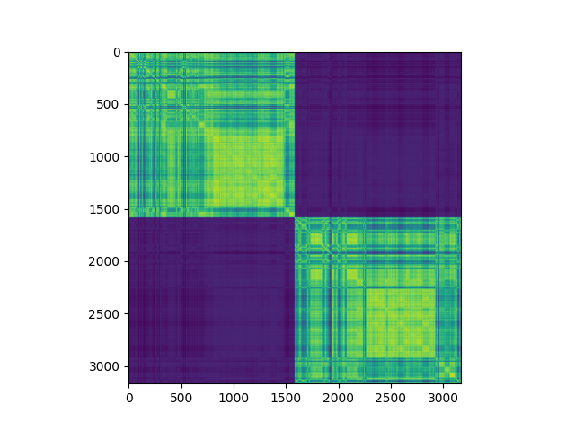
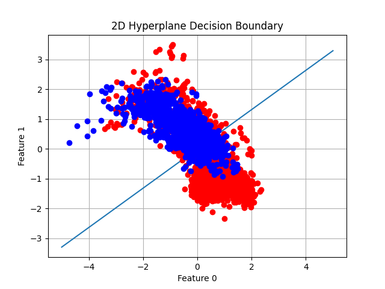
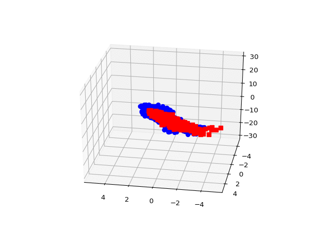

# DualPerceptron


### Usage
*   #### Perceptron Class:  
    *   In this implementation the Perceptron offers several methods
        for different use cases.  
        For example: to train and test on a given dataset one must create 
        a Perceptron first, then use the method fit() and finally the method 
        predict_set() as follows:  
        
        ```python  
            clf = Perceptron.Perceptron(dataset_name, train_x, train_y, 
                                        kernel, epochs, sigma, dim)  
            clf.fit()  
            predicted = clf.predict_set(test_x, test_y)  
            accuracy = clf.accuracy(test_y, predicted)  
        ```
        
    *    The Perceptron automatically creates or loads a Gram Matrix accordingly to 
        the given kernel.  
        One can also predict a single element:  
        
        ```python
            clf.predict_element(self, an_element)
        ```  

*   #### OptimizedTools.py
    This files is the heart of the perceptron, it can't be used as a standalone.
    A Perceptron object delegates the fitting, the prediction and the creation of a 
    Gram Matrix to this file.
    
*   #### DatasetTools.py
    This python file loads a dataset properly for a Perceptron,
    for example, it contains functions to normalize the dataset and 
    to convert string features to numerical features. 
    This is an example of a basic usage:  
    
    ```python
        train_set, test_set = load_dataset(dataset_name, split_train_percentage, normalize=False, standardize=False)
    ```  
    
*   #### KernelValidation.py
    This .py script plots a gram matrix of some given dataset.
    The dataset is pre-ordered based on the labels so the gram 
    matrix can be used to visualize the classes of the dataset
    It is meant to be used as a standalone in this project.
    
    This is an example of the output:    
    
    
*   #### Plotter.py
    This file contains two functions to plot the hyperplane and the elements 
    in 2D or 3D. The datasets used have more than three features so the output 
    in this case is just for the scope of the illustration.
    Basic usage:
    ```python
        Plotter.plot_2d(clf, X, y)
    ```  
    
    
    
    The 3D plot function can be used as follows:
    ```python
        Plotter.plot_3d(clf, X, y)
    ```
    This saves 70 .png files of the 3d scatter plot and hyperplane that
    can be converted to a .gif file from a linux terminal as follows:
    ```
        convert -delay 10 plot_step*.png animated_plot.gif
    ```
    
            
    
        
        
        
        
